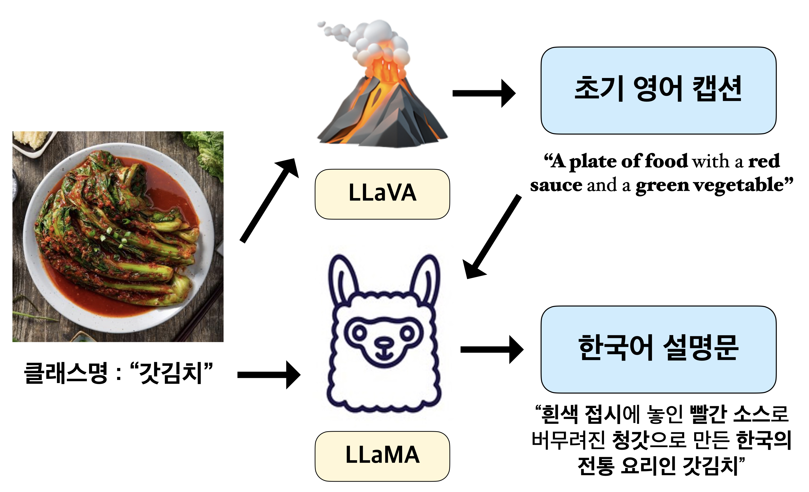
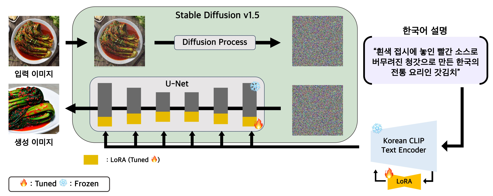
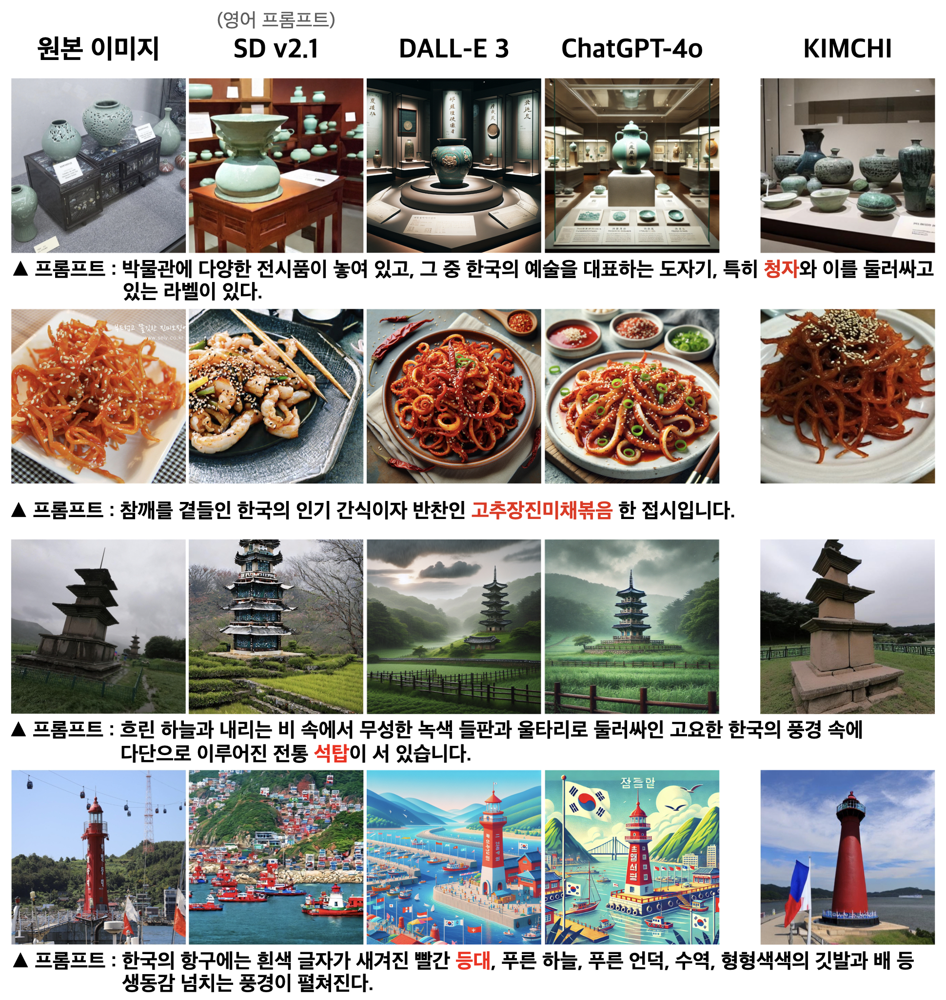

# KIMCHI: Korean dIffusion Model Adapting Culture and HIstory
> **KIMCHI: 한국의 문화와 역사를 반영한 한국어 이미지 생성 모델**, 서용득, 권용근, 이노아, 정규헌, 조성우, 장시온, 최성철, 2025, 한국CDE학회 동계학술대회 논문집

<div align="center">
    <table width="100%">
        <tr>
            <td width="40%" align="center">
                
            </td>
            <td width="60%" align="center">
                
            </td>
        </tr>
    </table>
</div>

# Setup
```
cd kimchi
pip install -r requirements.txt
```

# Run
## Dataset name
- 한국적 이미지(Korean Images): 'yonggeun/korean-image-caption-dataset'
- 한국 랜드마크 이미지(Korean Landmark Images): 'yonggeun/korean-landmark-image-caption-dataset'
- 한국 유적지 이미지(Korean Historical Site Images): 'yonggeun/korean-historical-building-image-caption-dataset'
- 한국 음식 이미지(Korean Food Images): 'letgoofthepizza/traditional-korea-food-captioning'

## Train
```bash
python train_text_to_image_all_lora.py  --pretrained_model_name_or_path='stable-diffusion-v1-5/stable-diffusion-v1-5' --dataset_name='letgoofthepizza/traditional-korea-food-captioning' --caption_column='text'  --resolution=512 --random_flip  --train_batch_size=16  --num_train_epochs=3 --checkpointing_steps=500  --learning_rate=1e-04 --lr_scheduler='constant' --lr_warmup_steps=0  --seed=42  --output_dir='korean-food-dataset-2'  --validation_prompt='배추김치' --report_to='wandb'
```
- Korean Landmark Images and Korean Historical Site Images use `caption_column='LLaMA_translation'`
- Korean Images and Korean Food Images use `caption_column='text'`

## Inference
```bash
python inference.py
```

# Inference Examples
<div align="center">
    
</div>